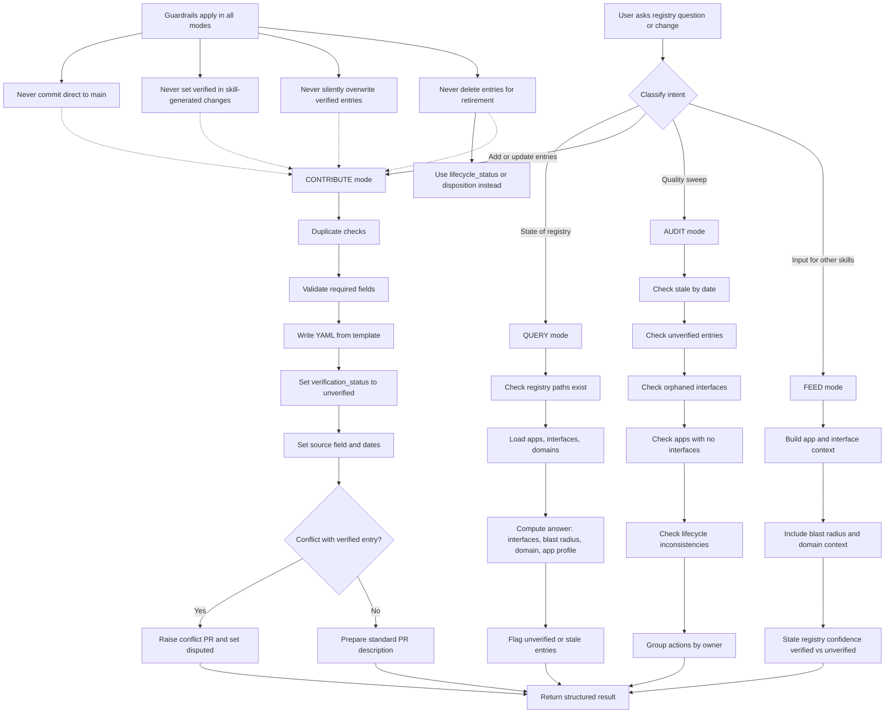

# EA Registry Skill README

This guide explains how to use the `/ea-registry` skill in this repository.

## Purpose

`/ea-registry` is the single skill used to query, contribute to, and audit the enterprise application and interface registry.

It supports four operating modes:
- `QUERY`: Answer questions about current registry contents
- `CONTRIBUTE`: Add or update registry entries (always via PR)
- `AUDIT`: Find stale, unverified, orphaned, or inconsistent entries
- `FEED`: Provide dependency context to other skills (`/discovery`, `/definition`, `/reverse-engineer`)

## Mermaid Diagram: How The Skill Works

## Quick Start

Use plain-language prompts; the skill infers mode from intent.

Example prompts:
- `What interfaces does card-issuing-platform have?`
- `What depends on card-issuing-platform?`
- `What is the blast radius of replacing card-issuing-platform?`
- `Audit the registry and show stale or unverified entries`
- `Register this application: [details]`
- `Add an interface from [source] to [target]`

## Mode Behavior

### QUERY
Use for read-only analysis.

Typical outputs:
- Interface inventory (inbound/outbound)
- Blast radius (direct and one-hop dependencies)
- Domain view (apps and boundary interfaces)
- Application profile summary

Quality rules:
- Flag `unverified` entries explicitly
- Flag `stale` entries explicitly
- Avoid presenting `disputed` entries as confirmed fact

### CONTRIBUTE
Use for adding or updating YAML entries.

Required behavior:
- Always work through PRs
- Always create entries as `verification_status: unverified`
- Always include `source` and review metadata
- Never overwrite verified data silently; raise conflict PR if needed

For new application entries:
- Start from `registry/applications/_template.yaml`
- Minimum fields: `slug`, `name`, `owner`, `domain`, `business_capability`, `tier`, `lifecycle_status`

For new interface entries:
- Start from `registry/interfaces/_template.yaml`
- Validate both applications exist first
- Filename pattern: `[source]--[target]--[name].yaml`

### AUDIT
Use for governance and hygiene checks.

Expected checks:
- Stale entries by `last_reviewed`/`last_verified`
- Unverified entries pending review
- Orphaned interfaces (source or target app missing)
- Applications with no interfaces
- Lifecycle inconsistencies

### FEED
Use to support other planning skills.

Provide:
- Application profile and lifecycle
- Direct dependencies and criticality
- Domain context
- Confidence summary (`verified` vs `unverified`)

## Repository Paths

- `registry/applications/`: application entries
- `registry/interfaces/`: interface entries
- `registry/domains/`: domain entries
- `registry/CONVENTIONS.md`: naming, taxonomy, and governance rules
- `.github/skills/ea-registry/SKILL.md`: operational instructions for the skill

## Contribution Workflow (Human + Skill)

1. Confirm intent and mode (`QUERY`, `CONTRIBUTE`, `AUDIT`, `FEED`).
2. For changes, perform duplicate and consistency checks.
3. Create or update YAML using templates and conventions.
4. Keep skill-generated additions as `unverified`.
5. Prepare PR description with affected files and requested reviewers.
6. Let owners/EA reviewers validate and set final verification status.

## Common Pitfalls

- Creating interfaces where source/target applications are not yet registered.
- Marking entries `verified` before reviewer confirmation.
- Updating verified entries directly without conflict handling.
- Treating unverified entries as definitive planning truth.

## Definition of Done

A `/ea-registry` task is complete when:
- Mode was correctly selected and stated.
- Output is structured and decision-ready.
- Any unverified/stale/disputed data is clearly called out.
- For contributions, PR-ready content is produced with correct metadata.
